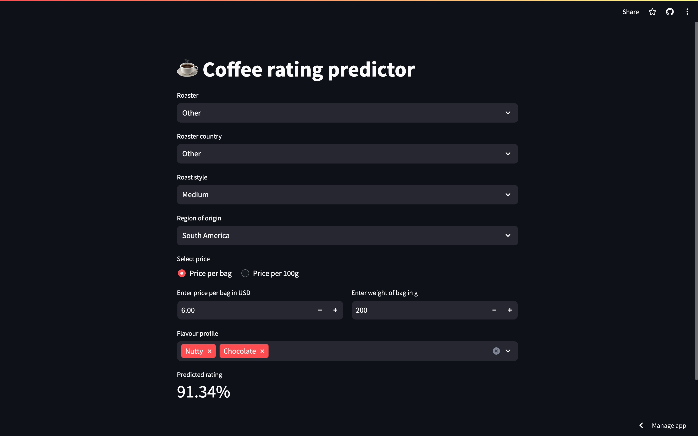

+++
title = 'Coffee Rating Prediction: Deployment'
series = ['Coffee Rating Prediction']
series_order = 3
date = 2023-11-21T20:12:00Z
showTableOfContents = true
+++

This was my first personal ML project. The goal was to familiarise myself with [XGBoost](https://xgboost.readthedocs.io/en/stable/) and [AWS Lambda](https://aws.amazon.com/lambda/). I enjoy drinking nice coffee, so I chose a topic which I hoped would help me buy better coffee in the future. The source code is available on GitHub.



## Background

In a [previous post]() in this series, we trained a model which was able to predict how highly rated a coffee would be on [CoffeeReview.com](http://CoffeeReview.com) based on the following features:

- Origin
- Roaster and roasting style
- Price
- Flavour profile

I will use this [dataset](https://www.kaggle.com/datasets/schmoyote/coffee-reviews-dataset/data) from Kaggle which contains ratings for ~1900 coffees.

## Deployment

The chosen model was wrapped within a `flask` webserver, which was in turn wrapped within a Docker container and deployed to AWS lambda. This allows us to make updates the model, and deploy a new model without needing to update the dashboard discussed below.

## Interactive dashboard

In order to be able to interact the model and predict ratings for arbitrary coffees, I created a Streamlit dashboard which you can access [here](https://coffee-rating-prediction.streamlit.app/). The dashboard generates the required features from the data inputted by the user, and then queries the model server. The predicted rating is then displayed in the dashboard. Have a play and see how your favourite coffee fares!

We can now apply use this model to predict the ratings of new coffees! :coffee:
