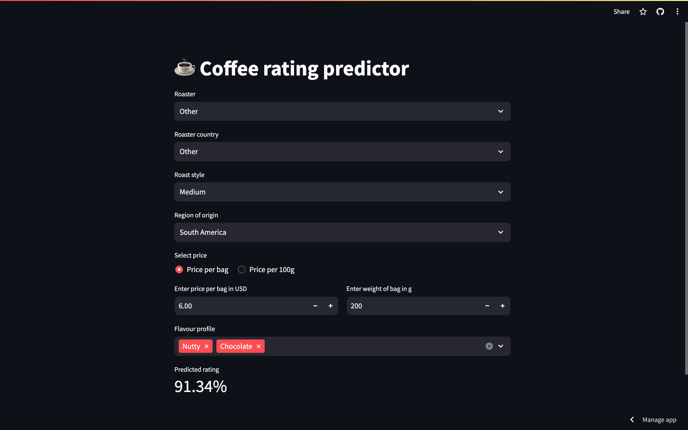

+++
title = 'Coffee Rating Prediction'
date = 2023-11-21T20:12:00Z
showTableOfContents = true
+++

This was my first personal ML project. The goal was to familiarise myself with [XGBoost](https://xgboost.readthedocs.io/en/stable/) and [AWS Lambda](https://aws.amazon.com/lambda/). I enjoy drinking nice coffee, so I chose a topic which I hoped would help me buy better coffee in the future. The source code is available on GitHub.



## Objective

The objective of this project is to be able to predict how highly rated a coffee would be on [CoffeeReview.com](http://CoffeeReview.com) based purely on information about the coffee such as:

- Origin
- Roaster and roasting style
- Price
- Flavour profile

## Exploratory data analysis

We begin by loading in the data from the dataset from [Kaggle](https://www.kaggle.com/datasets/schmoyote/coffee-reviews-dataset/data). I also renamed the columns to more clearly distinguish between the country of origin and roaster country.

```python
import pandas as pd

df = pd.read_csv("./data/simplified_coffee.csv")
for col in ["name", "roaster", "roast", "loc_country", "origin", "review"]:
    df[col] = df[col].astype("string")

df["review_date"] = pd.to_datetime(df["review_date"])
df = df.rename(columns={"loc_country": "roaster_country", "100g_$": "price_per_100g", "origin": "country_of_origin"})
df.head()
```

Let us first check for NaNs.

```python
df.isna().sum()
```

| name              | 0   |
| ----------------- | --- |
| roaster           | 0   |
| roast             | 12  |
| roaster_country   | 0   |
| country_of_origin | 0   |
| price_per_100g    | 0   |
| rating            | 0   |
| review_date       | 0   |
| review            | 0   |

The only column with NaNs is the roast. Since there are only 12 missing values, we could just remove these rows. However, since most coffees have the same roast type (as will see later), let us fill with the modal value.

```python
df["roast"] = df["roast"].fillna(df["roast"].mode().iloc[0])
```

Let's fix a typo in the roaster country for one coffee.

```python
df["roaster_country"] = df["roaster_country"].str.replace("New Taiwan", "Taiwan")
```

Some roasters were being duplicated due to the presence of the characters below, so let us replace them with the English equivalent for consistency:

```python
replace = {"’s": "'s", "é": "e", "’": "'"}
for k, v in replace.items():
    df["roaster"] = df["roaster"].str.replace(k, v)
```

### Ratings

We can see that the ratings are approximately normally distribution. However, the median rating is surprisingly high at ~94%.

```python
df["rating"].hist(histnorm='percent', labels={"value":"rating [%]"})
```



### Coffee pricing

The distribution for the price of the coffee has a very long tail, due to a few very expensive coffees. This suggests that there may be benefit in applying the log transformation.

```python
df["price_per_100g"].hist((histnorm='percent', labels={"value":"price per 100g [$]"})
```



Now that we have applied the log transformation, the distribution is closer to a normal distribution.

```python
df["price_per_100g"].apply(np.log1p).(histnorm='percent', labels={"value":"price per 100g [log $]"})
```



### Roasting style

The vast majority of the coffee have the medium-light roast type. This large bias in the dataset may make it challenging for a model to detect any impact of roast style on coffee rating.

```python
df["roast"].hist(histnorm="percent", labels={"value":"roast"})
```



### Roaster country

Most of the data we have is from US rosters.

```python
df["roaster_country"].value_counts()
```

| roaster_country |     |
| --------------- | --- |
| United States   | 774 |
| Taiwan          | 339 |
| Hawai'i         | 77  |
| Guatemala       | 24  |
| Hong Kong       | 9   |
| Japan           | 8   |
| England         | 7   |
| Canada          | 5   |
| Australia       | 1   |
| China           | 1   |
| Kenya           | 1   |

If we look at the distribution of pricing for the most common countries, we see that the distribution is quite different in each country. In particular, the coffees sold in the US are much more "peaky". This likely indicates that there is some bias in the dataset. Given that CoffeeReview is based in the US, there are disproportionately more affordable coffees from US roasters.


This strong bias towards coffees roasted in the US means that it is unclear how well our will apply to coffees roasted outside the US. In addition, the number of different countries present is very small, and we cannot for example, predict if coffees from German roasters would be more or less likely to be highly rated.


```python
import plotly.express as px

countries = ["United States", "Taiwan", "Guatemala"]
px.histogram(
    df[df["roaster_country"].apply(lambda c: c in countries)],
    x="price_per_100g",
    color="roaster_country",
    barmode="group",
    histnorm='percent',
)
```



### Country of origin

We will now examine the country of origin for the different coffees:

```python
df["region_of_origin"].hist(histnorm="percent", labels={"value":"country of origin"})
```



As expected, most of the coffees come from the largest coffee producing regions in the world. Almost all examples are from one of the following regions:

- Africa such as Ethiopia or Kenya
- Central or South America such as Colombia or Guatemala

There are also a lot of coffees from Hawaii, which is likely again because the data is from a US-based website.

### Highly and lowly rated coffees

If we look at the highest and lowest rates coffees, we see that they are dominated by certain roasters.

```python
df.loc[df["rating"] > 96, ["name", "roaster"]].groupby("roaster").count()
```

| roaster                    | count |
| -------------------------- | ----- |
| Barrington Coffee Roasting | 1     |
| Bird Rock Coffee Roasters  | 1     |
| Dragonfly Coffee Roasters  | 1     |
| Hula Daddy Kona Coffee     | 1     |
| JBC Coffee Roasters        | 3     |
| Kakalove Cafe              | 1     |
| Paradise Roasters          | 2     |

```python
df.loc[df["rating"] < 90, ["name", "roaster"]].groupby("roaster").count()
```

| roaster      | count |
| ------------ | ----- |
| El Gran Cafe | 8     |
| Other        | 4     |

This suggests that either:

- Certain roasters find the best/worst coffees or roast them particularly well
- The reviewers favour/dislike certainer roasters

In either case, our model may need to access the roaster.

## Feature engineering

### Roaster

Let's first verify that the information about each roaster (in this case only country) is consistent across all coffees from the same roaster.

```python
def _assert_identical_values(df: pd.DataFrame) -> pd.Series:
    assert (df.iloc[1:, :] == df.iloc[0, :]).all().all()
    return df.iloc[0, :]


roaster_map = df[["roaster", "roaster_country"]].groupby("roaster").first()["roaster_country"]
```

There is evidence that certain roasters product particularly good/poor coffee (or are preferred/disliked by the reviewers). The model may therefore need a feature giving it this information.

We cannot simply convert the roaster using one-hot encoding as there are too many different values. Let us instead only include the most common roasters (those with > 10 coffees).

```python
roasters = df["roaster"].value_counts()
popular_roasters = sorted(roasters[roasters > 10].index)
```

Let's save this information to [`roasters.json`](https://github.com/alxhslm/coffee-rating-prediction/blob/main/data/roasters.json) for later use.

```python
roaster_info = {"known_roasters": roaster_map.to_dict(), "popular_roasters": popular_roasters}
with open("data/roasters.json", "w") as f:
    json.dump(roaster_info, f, indent=4)
```

We can now use this information to engineer roaster features with a smaller number of uniqute values.

```python
df["roaster"] = df["roaster"].where(df["roaster"].apply(lambda r: r in popular_roasters), "Other")
```


If we find these features have a strong influence on the model, we need to be careful when applying the model to new coffees from unknown roasters. Even if the coffee is from a well-known roaster, they will have a "roaster" value of "Other" if they are not present in the training set.


### Region of origin

The different regions of the world typically produce coffees which are similar in style. Eg African coffees are typically more acidic. Therefore it seems possible that the region may provide as much information as the country of origin. We will therefore engineer this feature.

```python
with open("./data/regions.json", "r") as f:
    REGIONS = json.load(f)

regions = {}
for r, countries in REGIONS.items():
    for c in countries:
        regions[c] = r

df["region_of_origin"] = df["country_of_origin"].map(regions).fillna("Other")
```

The vast majority of coffees in the dataset come from the major coffee producing regions of the world as expected.

```python
df["region_of_origin"].hist(histnorm="percent", labels={"value":"region of origin"})
```



### Flavour notes

As it stands, we cannot glean any information from the review column as it is unstructured. Let's begin by analysing the keywords present in the reviews.

```python
import re


def extract_words(string: str) -> list[str]:
    return re.findall(r'\w+', string.lower())


words = pd.Series([word for review in df["review"] for word in extract_words(review)]).value_counts()

GENERIC_WORDS = ["and", "in", "with", "the", "of", "to", "a", "by", "like", "is", "around"]
COFFEE_WORDS = ["cup", "notes", "finish", "aroma", "hint", "undertones", "resonant", "high", "consolidates", "flavor"]
words = words.drop(GENERIC_WORDS + COFFEE_WORDS)
words.head()
```

We can see that the most common words relate to the flavour of the coffee. This suggests that we can extract some features for the different flavours in the coffee.

Using this information and the [coffee flavour wheel](https://www.anychart.com/products/anychart/gallery/Sunburst_Charts/Coffee_Flavour_Wheel.php), we can manually define some flavours and corresponding keywords which are stored in [`flavours.json`](https://github.com/alxhslm/coffee-rating-prediction/blob/main/data/flavours.json).

```python
with open("./data/flavours.json", "r") as f:
    FLAVOURS = json.load(f)
```

We can now add boolean features for each flavour.

```python
def rating_contains_words(review: str, keywords: list[str]) -> bool:
    words = extract_words(review)
    for w in keywords:
        if w in words:
            return True
    return False


for flavour, keywords in FLAVOURS.items():
    df[flavour] = df["review"].apply(rating_contains_words, args=(keywords,))
```

Let's now combine the flavours into a single column.

```python
df["flavours"] = df.apply(lambda coffee: [flavour for flavour in FLAVOURS if coffee[flavour]], axis=1)
```

It is useful to examine the popularity of the different flavours, by plotting the histogram. We can see that the most common flavours are:

- Caramelly
- Acidic
- Fruity
- Chocolate

Intuitively, this makes sense as these are the sorts of flavours we see on coffee packets.

```python
df[list(FLAVOURS.keys())].sum().divide(df.shape[0]).sort_values(ascending=False).plot.bar(labels={"index":"flavour"})
```



It is also interesting to check how many flavours the different coffees have. If we have done a good job at defining the flavour keywords, we would expect not many coffees to have no flavours.

```python
df[list(FLAVOURS.keys())].sum(axis=1).hist(histnorm="percent", labels={"value":"num_flavours"})
```



Indeed, this appears to be the case. All coffees have at least some flavours, and in fact, most coffees have 6 flavours!

## Building a model

```python
features = ["roaster", "roast", "roaster_country", "region_of_origin", "price_per_100g", "flavours"]
X = df[features].copy()
X["price_per_100g"] = X["price_per_100g"].apply(np.log1p)
y = df["rating"]
```

- Split the dataset into train/validation/test sets with 60%/20%/20% distribution.
- Use the `train_test_split` function and set the `random_state` parameter to 1.

```python
from sklearn.model_selection import train_test_split

X_train_val, X_test = train_test_split(X, test_size=0.2, random_state=1)
y_train_val, y_test = train_test_split(y, test_size=0.2, random_state=1)

X_train, X_val = train_test_split(X_train_val, test_size=0.25, random_state=1)
y_train, y_val = train_test_split(y_train_val, test_size=0.25, random_state=1)
```

```python
from sklearn.feature_extraction import DictVectorizer

dv = DictVectorizer(sparse=False)
dv.fit(X_train.to_dict(orient="records"))


def _transform(df: pd.DataFrame):
    return dv.transform(df.to_dict(orient="records"))
```

### Linear regression

Let's start with the simplest model which is a linear regressor.

```python
from sklearn.linear_model import Ridge
from sklearn.metrics import mean_squared_error

scores = pd.DataFrame(columns=["test", "validation"])
for alpha in [0.01, 0.03, 0.1, 0.3, 1.0, 3.0, 10.0]:
    model = Ridge(alpha=alpha)
    model.fit(_transform(X_train), y_train)
    scores.loc[alpha, :] = pd.Series(
        {
            "test": mean_squared_error(y_train, model.predict(_transform(X_train)), squared=False),
            "validation": mean_squared_error(y_val, model.predict(_transform(X_val)), squared=False),
        }
    )

fig = scores.plot(log_x=True, labels={"index":"alpha", "value":"loss"})
```



This suggests that the best value is 1.0 since this gives the same loss on the validation and test sets. We can now fit a model on the combined train and validation set.

```python
linear_model = Ridge(alpha=1.0)
linear_model.fit(_transform(X_train_val), y_train_val)
```

This model captures the central part of the distribution quite well, but fails to predict the very high or low ratings.

```python
pd.DataFrame(
    {"true": y_train_val, "prediction": np.round(linear_model.predict(_transform(X_train_val)), decimals=0)}
).hist(histnorm="percent", barmode="group", labels={"value": "rating [%]"})
```



### Gradient-boosted trees

```python
import xgboost as xgb

eval_sets = {
    "train": (_transform(X_train), y_train),
    "validation": (_transform(X_val), y_val),
}

scores = {}
for max_depth in [1, 2, 3, 4, 5]:
    xgb_params = {
        'max_depth': max_depth,
        'min_child_weight': 1,
        'objective': 'reg:squarederror',
        'seed': 1,
        'verbosity': 1,
    }

    model = xgb.XGBRegressor(**xgb_params, eval_metric="rmse")
    model.fit(_transform(X_train), y_train, eval_set=list(eval_sets.values()))

    results = model.evals_result()
    scores[max_depth] = pd.DataFrame({k: results[f"validation_{i}"]["rmse"] for i, k in enumerate(eval_sets)})

pd.DataFrame({depth: df["validation"] for depth, df in scores.items()}).plot(
    labels={"index": "n_estimators", "variable": "max_depth", "value": "rmse"}
)
```



This suggests that we should pick `max_depth`=2 or 3 to prevent overfitting. Let us select `max_depth`=3 with 90 estimators, since this gives the lowest validation loss.

```python
scores = {}
for eta in [0.01, 0.03, 0.1, 0.3, 1.0]:
    xgb_params = {
        'max_depth': 3,
        'n_estimators': 90,
        "eta": eta,
        'min_child_weight': 1,
        'objective': 'reg:squarederror',
        'seed': 1,
        'verbosity': 1,
    }

    model = xgb.XGBRegressor(**xgb_params, eval_metric="rmse")
    model.fit(_transform(X_train), y_train, eval_set=list(eval_sets.values()))

    results = model.evals_result()
    scores[eta] = pd.DataFrame({k: results[f"validation_{i}"]["rmse"] for i, k in enumerate(eval_sets)})

pd.DataFrame({eta: df["validation"] for eta, df in scores.items()}).plot(
    labels={"index": "n_estimators", "variable": "eta", "value": "rmse"}
)
```



To prevent overfitting, we should select `eta` = 0.3.

```python
xgb_params = {
    'max_depth': 3,
    'n_estimators': 90,
    "eta": 0.3,
    'min_child_weight': 1,
    'objective': 'reg:squarederror',
    'seed': 1,
    'verbosity': 1,
}
xgb_model = xgb.XGBRegressor(**xgb_params, eval_metric="rmse")
xgb_model.fit(_transform(X_train_val), y_train_val, eval_set=[(_transform(X_train_val), y_train_val)])
results = xgb_model.evals_result()
scores = pd.Series(results[f"validation_0"]["rmse"])
```

In the same way as the linear model, this model fails to capture the very low or high ratings.

```python
pd.DataFrame(
    {
        "true": y_train_val,
        "prediction": np.round(xgb_model.predict(_transform(X_train_val)), decimals=0),
    }
).hist(histnorm="percent", barmode="group", labels={"value": "rating [%]"})
```



### Feature importances

We can get a bit more insight by evaluating the importance of the difference features.

```python
from sklearn.inspection import permutation_importance

importances = {}
for name, model in models.items():
    r = permutation_importance(model, _transform(X_train_val), y_train_val, n_repeats=10, random_state=0)
    importances[name] = pd.Series(dict(zip(dv.get_feature_names_out(), r.importances_mean)))

importances = pd.DataFrame(importances)
```

| feature                       | linear   | xgb       |
| ----------------------------- | -------- | --------- |
| price_per_100g                | 0.197381 | 0.244563  |
| flavours=fruity               | 0.067031 | 0.078077  |
| region_of_origin=East Africa  | 0.072613 | 0.052817  |
| roaster_country=Taiwan        | 0.057250 | 0.028345  |
| roaster=Other                 | 0.027719 | 0.050806  |
| roast=Light                   | 0.047623 | 0.002267  |
| roaster=El Gran Cafe          | 0.020535 | 0.045360  |
| roaster=Kakalove Cafe         | 0.037606 | 0.035591  |
| roaster_country=United States | 0.035916 | -0.002266 |
| roast=Medium-Light            | 0.029053 | 0.015307  |

We can see in both cases that the biggest influence is the price. This suggests that either:

- Price is genuinely an indicator of quality
- Price biases the reviewers

Other than the price, the region of origin plays a big influence. Surprisingly the flavour notes do not have that much influence apart from the fruitiness. Whether a coffee is roasted by certain roasters does have a non-negligible impact on the rating.

```python
importances.loc[importances.max(axis=1).sort_values(ascending=False).index].head(10)
```

### Model selection

We can evaluate the losses on the test dataset, and see which model is most accurate.

```python
models = {"linear": linear_model, "xgb": xgb_model}

scores = pd.DataFrame(dtype=float)
for name, model in models.items():
    loss_train = mean_squared_error(y_train_val, model.predict(_transform(X_train_val)), squared=False)
    loss_test = mean_squared_error(y_test, model.predict(_transform(X_test)), squared=False)
    scores[name] = pd.Series({"train": loss_train, "test": loss_test})

fig = px.bar(scores.transpose(), barmode="group", labels={"index": "model", "value": "loss"})
```



We can see that the two models display similar performance, and predict a similar distribution of ratings with shorter tails. This suggests that the model is not the reason for failing to predict the highest/lowest scores is more due to some other more systematic error such as:

- Lack of information in the features (eg perhaps we need more detailed information about the origin)
- System error in the reviews (eg different reviewers)

```python
pd.DataFrame(
    {"true": y_test} | {name: np.round(model.predict(_transform(X_test)), decimals=0) for name, model in models.items()}
).hist(histnorm="percent", barmode="group")
```



Overall, the two models have very similar performance. Since the linear regression model is simpler (and has _slightly_ better performance), this is the preferred model.

## Deployment

The chosen model was wrapped within a `flask` webserver, which was in turn wrapped within a Docker container and deployed to AWS lambda. This allows us to make updates the model, and deploy a new model without needing to update the dashboard discussed below.

### Interactive dashboard

In order to be able to interact the model and predict ratings for arbitrary coffees, I created a Streamlit dashboard which you can access [here](https://coffee-rating-prediction.streamlit.app/). The dashboard generates the required features from the input data, and then calls the model server. Have a play and see how your favourite coffee fares!



## Conclusions

We have shown that it is possible to predict how highly rated a coffee would be on CoffeeReview.com based purelty on information about the coffee and a linear model. We have shown that the biggest influencers on rating are:

- Price
- Fruityness
- If a coffee is from East Africa

We showed that the model could predict the rating to quite a high degree of accuracy, but struggled to predict particularly low or highly rated coffees. However, overall it produced an unbiased estimate. We can now apply use this model to predict the ratings of new coffees! :coffee:
