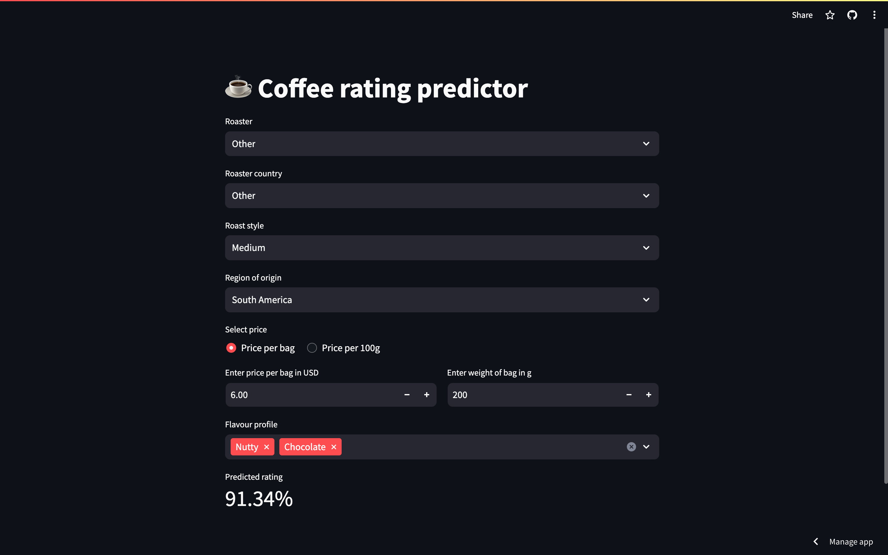

+++
title = 'Coffee Rating Prediction'
date = 2023-11-09T00:00:00Z
tags = ['machine learning', 'modelling', 'deployment', 'aws']
summary = 'Predicting specialty coffee review ratings from roaster, origin, and flavour data, deployed via AWS Lambda and Streamlit.'
subtitle = 'Predictive rating model and serverless deployment'
showSummary = true
group = 'Experiments & demos'
weight = 3
aliases = [
  '/projects/coffee-rating-prediction/eda',
  '/projects/coffee-rating-prediction/eda/',
  '/projects/coffee-rating-prediction/model',
  '/projects/coffee-rating-prediction/model/',
  '/projects/coffee-rating-prediction/deployment',
  '/projects/coffee-rating-prediction/deployment/',
]
+++

I enjoy drinking good coffee, but buying specialty coffee can be a bit of a gamble. With so many variables like origin geography, roast level, price, and subjective tasting notes, it's hard to tell how good a coffee will actually be before buying it. I wondered if a data-driven approach could help predict coffee quality and help me pick better beans.

To test this out, I built an end-to-end regression model and deployment pipeline using [XGBoost](https://xgboost.readthedocs.io/en/stable/) and containerized serverless inference on [AWS Lambda](https://aws.amazon.com/lambda/), connected to an interactive [Streamlit dashboard](https://coffee-rating-prediction.streamlit.app/). The source code is available on [GitHub](https://github.com/alxhslm/coffee-rating-prediction).



## Objective & Dataset

The objective of this project is to be able to predict how highly rated a coffee would be on [CoffeeReview.com](http://CoffeeReview.com) based purely on information about the coffee such as:

- Origin
- Roaster and roasting style
- Price
- Flavour profile

I used a [dataset](https://www.kaggle.com/datasets/schmoyote/coffee-reviews-dataset/data) from Kaggle containing ratings for ~1,900 coffees.

## Feature Selection & Exploratory Analysis

We have quite a few features available, but not all lead to a significant improvement in the accuracy of the model. I began by assessing the importance of the different features quantitatively using correlation and [mutual information](https://en.wikipedia.org/wiki/Mutual_information):

| Feature             | Metric                  | Score | Insight                                                 |
| ------------------- | ----------------------- | ----- | ------------------------------------------------------- |
| `roaster`           | Mutual information      | 0.670 | Largest overall influence on rating                     |
| `country_of_origin` | Mutual information      | 0.159 | Origin country strongly impacts cup quality             |
| `price_per_100g`    | Correlation coefficient | 0.242 | Moderately positive correlation with rating             |
| `roaster_country`   | Mutual information      | 0.068 | Roaster location contributes slight signal              |
| `roast`             | Mutual information      | 0.046 | Lighter and medium roasts score higher than dark roasts |

### Price vs Rating

To visualise the influence of price on the rating, we can look at the relationship between `price_per_100g` and `rating`:



There is positive correlation between the two variables, though with noticeable scatter. There is also evidence of diminishing returns as price increases, with the curve flattening off at higher prices.

### Influence of Origin

Looking at average ratings by global growing region:



East African coffees (e.g. Ethiopia, Kenya) achieve the highest average ratings, whereas Central American lots show slightly lower averages on CoffeeReview.

### Flavour Profile Impact

By parsing tasting notes from review text into categorical indicators, we can compute the difference in mean rating for coffees with versus without each flavour note:



Fruit and floral notes show the largest positive delta on review score, while resinous notes correspond with lower ratings.

## Predictive Modelling

I trained and evaluated regularized linear regression and gradient-boosted decision trees (`XGBoost`) using 5-fold cross-validation.

### Hyperparameter Tuning on XGBoost

Evaluating root-mean-square error (RMSE) on training and validation folds across increasing maximum tree depth:



As `max_depth` increases beyond 2, the training loss decreases without a corresponding decrease in validation loss, indicating overfitting. A shallower tree with `max_depth = 2` and a learning rate of `eta = 0.3` provided the best validation performance.

### Model Comparison

Comparing training and test losses across models:



Both the regularized linear model and tuned `XGBoost` model achieve comparable test performance. Linear regression provides strong interpretability, while boosted trees capture non-linear interactions between roaster reputation and specific origins.

## Serverless Deployment

To make the model interactively accessible without running a 24/7 server instance, I deployed the inference pipeline using a containerized serverless architecture:


graph TD
E[User Browser]-.->A[Streamlit Web App]
A--HTTP Request (JSON Features)-->B[AWS Lambda]
B--Rating Prediction-->A
subgraph Docker container on AWS Lambda
D[Model Runtime / Scikit-Learn + XGBoost]
end
B---D


- **Docker Container**: Packaged the Python runtime and dependencies using [`poetry`](https://python-poetry.org/) and published the container image to Amazon ECR.
- **AWS Lambda Function URL**: Served via a serverless [Lambda Function URL](https://docs.aws.amazon.com/lambda/latest/dg/lambda-urls.html) authenticated via IAM, keeping idle costs zero with sub-second response times.
- **Streamlit Web Dashboard**: Built an interactive UI where users can adjust roast, origin, price, and flavour notes to receive real-time score predictions.

## Try It Out

You can try out the deployed dashboard [here](https://coffee-rating-prediction.streamlit.app/) next time you're buying coffee to see how different origins, roasts, and flavour notes score!
