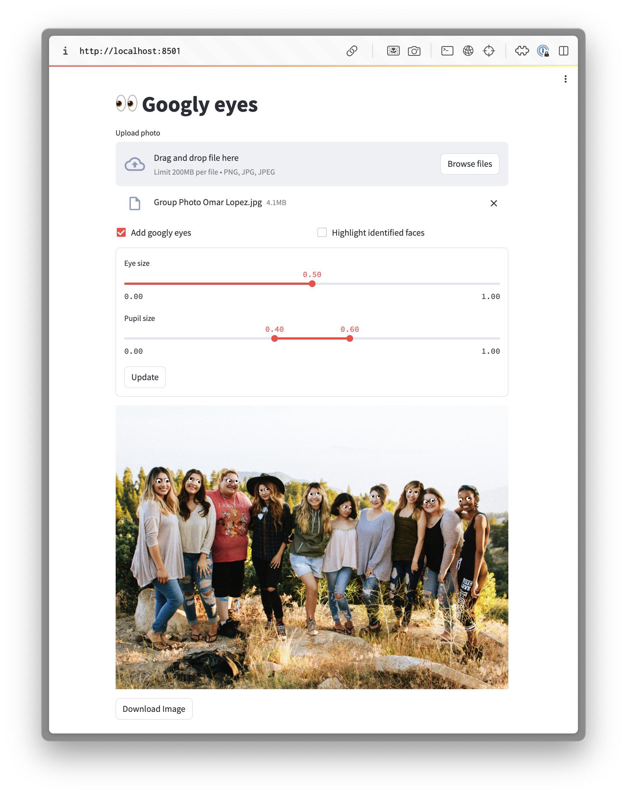

+++
title = 'Googly Eyes'
date = 2024-02-08T14:00:00Z
tags = ['computer vision', 'deployment']
+++



The aim of this project was for me to get some experience with computer vision problems. I found that the results were quite fun, so I decided to tidy up the code and deploy it. You can access the deployed Streamlit dashboard [here](https://googly-eyes.streamlit.app/).



## Problem description

The objective was to create a system which could automatically overlay googly eyes on top of people's actual eyes in a given photo as shown below. I wanted it to work even if there was more than one person in the photo.



### Assumptions

To simplify the problem, I made the following assumptions:

- We only wish to detect human faces (and not pets)
- The faces are approximately aligned with the vertical axis of the photo, so the face detection step does need to be robust to misalignment
- The people will be facing the camera in the photos (or close to it), so we do not need to consider 3D geometric effects when placing the eyes

### Project plan

This problem can be decomposed into the following steps:

- Build a build to identify eyes in photos of people
- Generate Googly eyes with random shapes and sizes
- Create a server which processes HTTP requests
- Create a UI to interact with the service

I will now explain how I achieved each of these steps.

## Eye identification

This is an _object localisation_ problem since:

1. We need to identify the locations of eyes in the image
2. We only need to classify a single class of objects

The most obvious approach for identifying eyes is to use a CNN, trained on pre-labelled images of people’s faces.

I considered two different approaches to identifying faces.

### Training a custom model

I could think of two possible architectures of identifying the faces:

1. Train a model to detect eyes directly from the photo
2. Use a 2-stage classifier as follows:
   - _Stage 1_: Identify faces
   - _Stage 2_: Identify eyes from each face

The latter approach has the potential to be more robust, since the eye identification model only has to consider faces, so is less likely to be "tricked" by other features in an image. However, it would be slower since two models need to be evaluated.

In either approach, we can make use of pre-trained image classification models for the main trunk of the model:

- They are often trained in datasets with people in so already have some capability to recognise faces and facial features
- The input layers of the network identify “features” which will transfer well to different applications

The dataset we use to train network is very important. We must ensure that it is representative of the sorts of images which the users will upload. Therefore typical datasets for biometric identification would not be suitable. Instead we should use a dataset with photos in more natural environments. The [LFW](https://www.kaggle.com/datasets/jessicali9530/lfw-dataset) dataset seems most suitable.

### Pre-trained models

Since the task of recognising faces and facial features is a very common one, we can make use of pre-existing models to perform this step for us. After a brief search, I came across many open-source models, the two most performant models being:

- **MTCNN** ([paper](https://ieeexplore.ieee.org/document/7553523))**:** [PyTorch implementation](https://github.com/timesler/facenet-pytorch) [TensorFlow implementation](https://github.com/ipazc/mtcnn)
- **RetinaFace**([paper](https://openaccess.thecvf.com/content_CVPR_2020/papers/Deng_RetinaFace_Single-Shot_Multi-Level_Face_Localisation_in_the_Wild_CVPR_2020_paper.pdf)): [PyTorch implementation](https://github.com/deepinsight/insightface/tree/master/detection/retinaface) [TensorFlow implementation](https://github.com/serengil/retinaface)

RetinaFace generally performs _slightly_ better, likely because it was trained with an augmented set of labels including 1k 3D vertices.

I chose to make use of the existing RetinaFace model, since this model would likely be much more accurate than any model I could train, without spending a lot of time on data processing and model training. This also allowed me to focus my time on the other aspects of the system.

I converted the Tensorflow model to use the Tensorflow-lite runtime instead. This required updating the model and pre-processing steps to use fixed image dimensions. This has two main advantages:

- It significantly reduces the size of the docker images
- It reduces execution time

## Googly-eye generation

Once we have detected the position of the eyes, we need to add the googly eyes in the correct location. I used the [`ImageDraw`](https://pillow.readthedocs.io/en/stable/reference/ImageDraw.html) module to perform the image manipulation and draw the eyes. However, I still needed to decide how to size the eyes and where to place the pupils.

### Eye size

To ensure that the googly eyes are of an appropriate size, independent of image dimensions or the distance from the face to the camera, I computed the eye-to-eye separation distance for a given face from:

$$
\Delta_{eye2eye}=\sqrt{(x_r-x_l)^2+(y_r-y_l)^2}
$$

where \\(x_r, y_r\\) are the pixel co-ordinates of each eye. I then set the radius of the googly eyes \\(r_e\\) by:

$$
r_e =\gamma\frac{\Delta_{eye2eye}}{2}
$$

where \\(\gamma\\) is a scaling parameter in the range \\(0<\gamma<1.0\\). I set the default value to 0.5.

### Pupil size

The pupil size \\(r_p\\) was set based on the eye size from:

$$
r_p=\lambda r_{e}
$$

where \\(\lambda\\) is a random variable sampled from the following distribution:

$$
\lambda \sim U(\lambda_1, \lambda_2)
$$

where the default values for the parameters \\(\lambda_1\\) and \\(\lambda_2\\) were set to 0.4 and 0.6 respectively.

### Pupil position and orientation

To randomise the position of the pupil, the position was set by the following equation:

$$
x_p = x_e+ (r_e-r_p) \sin \theta
$$

$$
y_p = y_e+ (r_e-r_p) \cos \theta
$$

where \\(\theta\\) is the random _orientation_ sampled from the following distribution:

$$
\theta \sim U(0,2\pi)
$$

## Local development

### Server

In order to handle the HTTP requests, I created a server using [Flask](https://flask.palletsprojects.com/en/3.0.x/). I created a single end-point specified as follows:

| Body                  | Response                    |
| --------------------- | --------------------------- |
| Image                 | Edited image                |
| Googly eye parameters | Locations of detected faces |

Both the body and response of the post request are in JSON format. In both cases, the photo is serialized as a Base64 string. Additional parameters for the eye and pupil size can be included in the body. This allows the client to adjust these settings to personal preference. The locations of the faces are returned for debugging purposes.

The server runs through the following steps:

1. Deserialize the request body to extract the image and parameters
2. Call the RetinaFace model to identify the faces in the images
3. Overlay eyes on each of the faces
4. Serialize the edited image and combine with the identified faces to form the response body

All image processing and manipulation was then performed in memory, so no images are ever stored to disk on the server.

When running the server in Docker, I used the [Waitress](https://docs.pylonsproject.org/projects/waitress/en/stable/index.html) web server. The Python dependencies are managed using [Poetry](https://python-poetry.org/) and the server is encapsulated within a [Docker container](https://github.com/alxhslm/googly-eyes/blob/main/server/Dockerfile).

### Dashboard

To allow the user to interact with the server more easily, I build a minimal dashboard using [Streamlit](https://streamlit.io/) which allows the user to:

- Upload a photo
- Adjust parameters for the googly eyes
- Download the modified photo

The dashboard then performs the following steps:

1. Gets the settings from the information entered by the user
2. Makes the HTTP request to the server to add the googly eyes
3. Overlay the identified faces for debugging purposes (if requested)
4. Displays the result and adds a download link

The dashboard is hosted in a separate [Docker container](https://github.com/alxhslm/googly-eyes/blob/main/dashboard/Dockerfile), with its own smaller set of dependencies using Poetry. The network connection to the server is configured using [Docker compose](https://github.com/alxhslm/googly-eyes/blob/main/docker-compose.yml).

## Cloud deployment

### Server

Since the server was already contained within a Docker container and contained only a single end-point, it was quite simple to convert it into an [AWS Lambda](https://aws.amazon.com/lambda/) function. I used an [AWS function URL](https://docs.aws.amazon.com/lambda/latest/dg/lambda-urls.html) to expose the AWS Lambda, with IAM authentication. This had the advantage that I did not need to manage any compute resources.

The main challenge I ran into was the the [AWS Python Lambda Docker images](https://hub.docker.com/r/amazon/aws-lambda-python) were based on a version of Amazon Linux with out-of-date system dependencies for the version of Tensorflow I was using. To get around this, I built a custom image using the process described [here](https://docs.aws.amazon.com/lambda/latest/dg/images-create.html#images-types), based on a Debian-based Python image from [Docker Hub](https://hub.docker.com/_/python).

I found that the AWS Lambda required 3GB of RAM to run the RetinaFace model reliably. However, it is quite slow due to the server being quite underpowered, and therefore needs a large 60s timeout.

### Dashoard

The Streamlit dashboard I built already in the [`dashboard`](https://github.com/alxhslm/googly-eyes/tree/main/dashboard) subdirectory could quite be deployed to [Streamlit cloud](https://streamlit.io/cloud) it is. This is because the dashboard used uses files from the shared [`common`](https://github.com/alxhslm/googly-eyes/tree/main/common) directory but Streamlit cloud dashboards only have access to files in the same directory.

To get around this limitation, I created a wrapper module [`app.py`](https://github.com/alxhslm/googly-eyes/blob/main/app.py) at the root of the repo, which in turn calls the existing dashboard code. This ensures that the deployed dashoard has access to the entire repo. This setup supports both local development and cloud deployment, without any code duplication.

The architecture of the system is shown below.


graph TD
subgraph Streamlit Cloud
subgraph Wrapper module
A
end
end
E[User]-.->A
A[Dashboard]--Image-->B[Lambda Function]
B--Edited image-->A
B--Image-->D[RetinaFace]
D--->F
F[Googlifier]--Edited image-->B
subgraph AWS
subgraph Docker container
B
D
F
end
end

