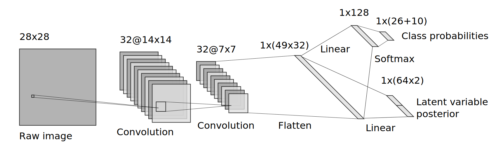
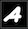

+++
title = 'Hand Writing Generation'
date = 2023-12-01T21:28:11Z
showTableOfContents = true
+++



This was another personal ML project, in which I wanted to gain some experience working with unstructured data. With all of the recent advancements in generative AI, also thought it would be interesting to use some form of generative model. The source code is available on GitHub.



## Objective

The aim of this project is to:

1. Train a model to classify hand-written alphanumeric characters
2. Generate synthetic hand-written characters using the same model

I used the standard [MNIST dataset](https://pytorch.org/vision/main/generated/torchvision.datasets.MNIST.html) which contains 70000 images of the numeric characters (0-9), and supplemented it with this [Kaggle dataset](https://www.kaggle.com/datasets/sachinpatel21/az-handwritten-alphabets-in-csv-format/) which contains 370000 images of the alphabetical characters (A-Z).

## Model

I decided to use a [Variational autoencoder](https://en.wikipedia.org/wiki/Variational_autoencoder) since dimensionality reduction is an area I find personally interesting. This is also one of the few widely used models uniting deep learning and Bayesian methods.

Typically a VAE is used for _unsupervised_ problems, as a non-linear method of dimensionality reduction. However, we have class labels in this case, so I instead implemented a _semi-supervised_ VAE. As we will see later, this will allow us to choose which character we reconstruct with the encoder.

The model was implemented using [`pytorch`](https://pytorch.org/). The encoder, decoder and loss function will be discussed below.

### Encoder

This part of the model predicts the latent variables corresponding to a given image. Rather than generating a point estimate for the latent variables, the encoder predicts the posterior distribution \\(p(z|x)\\):

$$ p(z|x) \approx N(\mu=q\_{x,1}(x), \sigma^2 = e^{q\_{x,2}(x))}$$

where \\(q\_{x,1}(x)\\) and \\(q\_{x,2}(x)\\) are approximated by a neural network within the encoder.

The encoder also predicts the class probabilities \\(p(y|x)\\):

$$p(y|x) \approx q_y(x)$$

where \\(q_y(x)\\) is also approximated as a neural network within the encoder.

The architecture of the encoder is shown in the diagram below:


It has the following layers:

- Convolutional layer + ReLU (input size 28x28x1, output size 14x14x32)
- Convolutional layer + ReLU (input size 14x14x32, output size 7x7x32)
- Flatten (input size 7x7x32, output size 1x(49x32))
- To generate _class labels_ \\(y\\):
  - Linear + ReLU (input size 49x32, output size 128)
  - Linear + Softmax (input size 128, output size 36) [^1]
- To predict mean and variance of _latent variables_ \\(z\\):
  - Linear (input size 1x(49x32), output size 1x(64x2))

[^1]: Note that in practice no `Softmax` is applied here since this is implicitly included as part of the `CrossEntropyLoss`, which leads to improved numerical stability


The dimension of the latent variables \\(z\\) was set to 64.


### Decoder

This part of the model reconstructs an image from class labels and latent variables. We first sample from the posterior distribution:

$$ z \sim N(\mu=q\_{x,1}(x), \sigma^2 = e^{q\_{x,2}(x)})$$

and we have already computed the class probabilities \\(p(y|x)\\). The final step is to then reconstruct an image from this information. The decoder has the following architecture, which is very similar to the encoder but in reverse:


This has the following layers:

- From _class labels_ \\(y\\) logits:
  - Linear + ReLU (input size 36, output size 128)
  - Linear (input size 128, output size 49x32)
- From _latent variables_ \\(z\\):
  - Linear (input size 64, output size 49x32)
- Unflatten (input size 49x32, output size 7x7x32)
- Deconvolutional layer + ReLU (input size 7x7x32, output size 14x14x32)
- Deconvolutional layer + Sigmoid (input size 14x14x32, output size 28x28x1) [^2]

[^2]: Note that in practice, no `Sigmoid` was applied here since this is implicitly included as part of the `BCEWithLogitsLoss`, which again leads to improved numerical stability

### Loss function

The last key component is the loss function. This is what allows us to train the model, and ensure that the encoder can accurately predict the posterior distribution and the decoder can accurately reconstruct images.

For a supervised VAE like this, we need 3 loss terms:

1. **Reconstruction loss** to enforce that the decoder can accurately reconstruct characters from the latent variables. This was implemented using `BCEWithLogitsLoss`.
2. **Categorical loss** to enforce that the model can accurately classify characters by predicting class probabilities \\(p(y|x)\\). This was implemented using `CrossEntropyLoss`.
3. **[Kullback-Leibler divergence](https://en.wikipedia.org/wiki/Kullback%E2%80%93Leibler_divergence) loss** to enforce that the encoder accurately predicts the posterior on the latent variables \\(p(z|x)\\).


1 & 3 would be needed for an unsupervised VAE as well, but 2 is an additional loss needed for the semi-supervised nature of this problem.


The KL-loss was implemented as follows:

```python
def kl_div_loss_fun(z_mean: torch.Tensor, log_z_var: torch.Tensor) -> torch.Tensor:
    return -0.5 * torch.sum(1 + log_z_var - z_mean.pow(2) - log_z_var.exp()) / z_mean.shape[0]
```

where `z_mean` is given by \\(q\_{x_1}(x)\\) and `log_z_var` is \\(q\_{x,2}(x)\\).

## Interactive dashboard

In order to get a better feel for how the model works, I created a Streamlit dashboard which allows you to interact with the model. You can access the dashboard [here](https://hand-writing-generation.streamlit.app/) and have a go yourself.


This dashboard goes through the following steps:

1. You being by drawing a few characters which gives us some observations \\(x\_{t}\\) This allows the encoder to produce an estimate of the posterior distribution \\(p(z|x\_{t})\\), which effectively allows the model to “learn” your writing style.
2. You can then generate arbitrary hand-written characters by sampling the distribution \\(p(x) = p(x|z, y)p(z)\\) where \\(p(z)=p(z|x\_{t})\\) and the value of \\(y\\) determines which character is generated.

By varying how you draw, you can change the style of characters which the model produces. Here are some examples of the sort of hand-written characters the model can synthesise:

| Prompt                                         | Description | Generated images                        |
| ---------------------------------------------- | ----------- | --------------------------------------- |
|  | Narrow      |  |
|      | Wide        |      |
|     | Light       |     |
|     | Bold        |     |
|  | Italic      |  |
